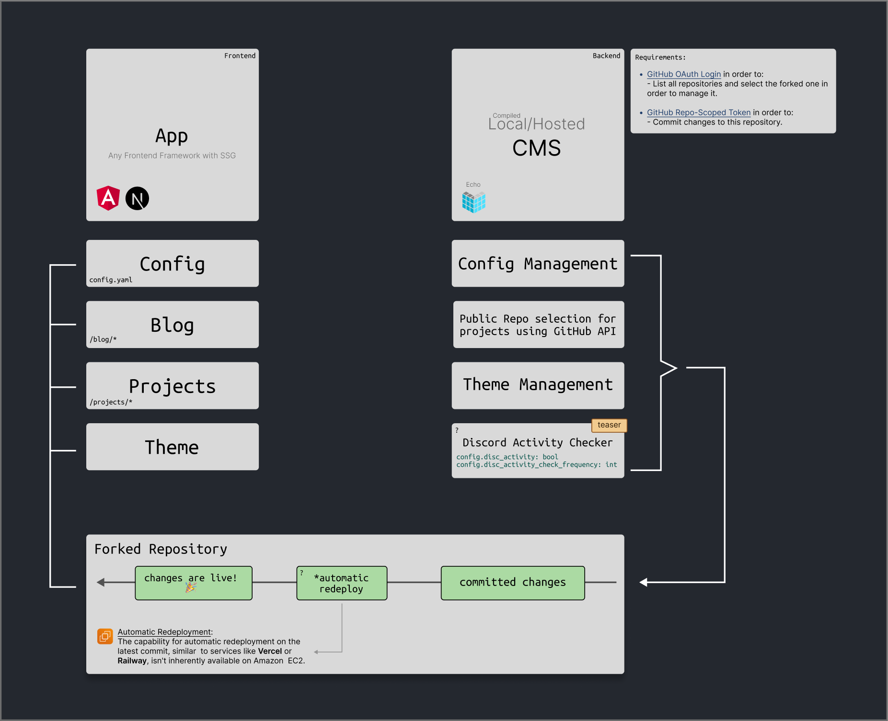

# hikko

hikko is a unique client and CMS combo designed to streamline website updates without relying on APIs for data delivery. By pushing changes directly to GitHub, it optimizes the workflow while continuing to utilize SSG and CDN.

## Mockup Showcase

    

